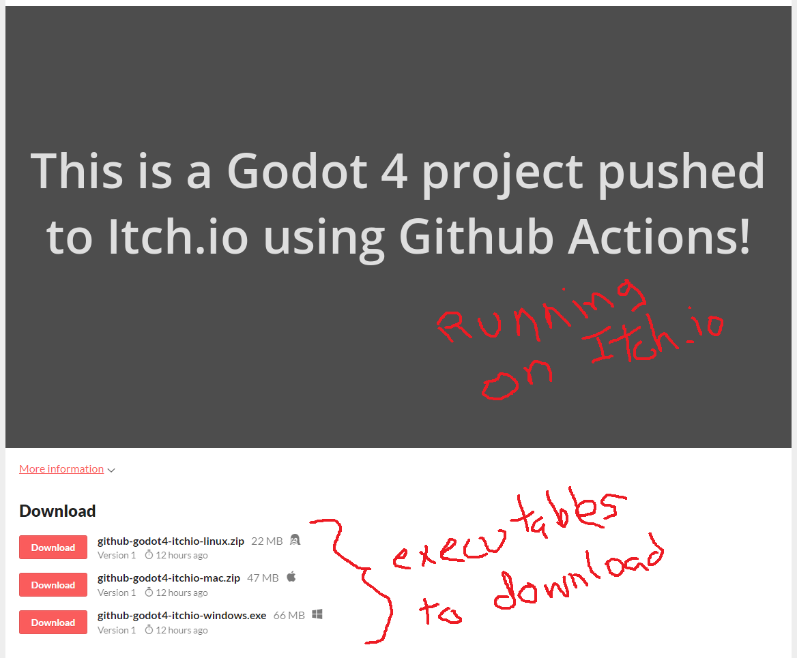
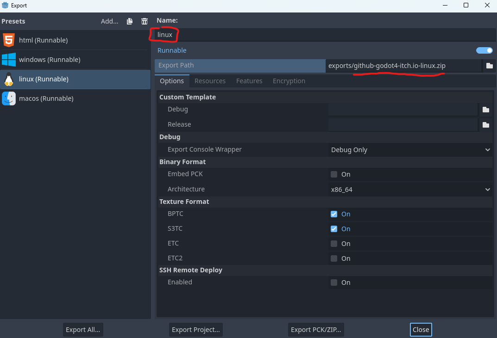
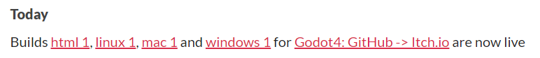

# Godot4: Github -> Itch.io

This is an example project with a single GitHub actions workflow to push a project to
[Itch.io](itch.io). The project will be playable on Itch.io at
[deplicator.itch.io/github-godot4-itchio](https://deplicator.itch.io/github-godot4-itchio) and have
a download for Linux, MacOS, and Windows.

## Setup

### Godot

The name of the Godot project and Itch.io project URL are the same. They contain no spaces or
invalid URL characters. They don't have to be this way, but the workflow script uses [an env called
`PROJECT_NAME`](https://github.com/deplicator/github-godot4-itch.io/blob/afe3a1f4d3b8bd4c9aae10372dfa7d97f03ec9bf/.github/workflows/deploy.yml#L9)
that relies on the consistency.

In Godot Exports, [the export
names](https://github.com/deplicator/github-godot4-itch.io/blob/afe3a1f4d3b8bd4c9aae10372dfa7d97f03ec9bf/export_presets.cfg#L3C1-L3C1)
use the same name as [Itch.io Channels](https://itch.io/docs/butler/pushing.html#channel-names). The
script uses the channel names `html`, `linux`, `macos`, and `windows` for
[building](https://github.com/deplicator/github-godot4-itch.io/blob/afe3a1f4d3b8bd4c9aae10372dfa7d97f03ec9bf/.github/workflows/deploy.yml#L38C15-L38C15)
and
[pushing](https://github.com/deplicator/github-godot4-itch.io/blob/afe3a1f4d3b8bd4c9aae10372dfa7d97f03ec9bf/.github/workflows/deploy.yml#L78)
to Itch.io.

Export path is `export/<project name>-<channel>.{zip|exe}`

- This example uses `exports/github-godot4-itch.io-linux.zip` for linux
- `html` is an exception, it will be `exports/html/index.html`, details in Workflow section below

### Itch.io

Setup a project in Itch.io with the same url name as the Godot project.

- Change **Kind of project** to HTML.

Under **Embed options**:

- Change the **Viewport dimensions** to match the game
  - This project uses Godot defaults of 1152x648
- Check the box next to **SharedArrayBuffer support**
  - _Note:_ This will not be playable on Safari, it's a [known
issue](https://docs.godotengine.org/en/stable/tutorials/export/exporting_for_web.html).
  - _Godot 4's HTML5 exports currently cannot run on macOS and iOS due to upstream bugs with
    SharedArrayBuffer and WebGL 2.0._

Get API Key by going to **User dropdown -> Settings -> API keys**. Generate a new API key or copy an
existing one. It will be used in the GitHub section next.

### GitHub

Add two secretes to the repository by going to **Settings -> Secrets and variables -> Actions -> New
repository secret**.

- `ITCHIO_API_KEY` - API key from Itch.io (copied in previous section)
- `ITCHIO_USERNAME` - Your Itch.io username, this doesn't have to be a secret, [it can be typed into
  the
  script](https://github.com/deplicator/github-godot4-itch.io/blob/afe3a1f4d3b8bd4c9aae10372dfa7d97f03ec9bf/.github/workflows/deploy.yml#L8)

## Using

The workflow defined at `.github\workflows\deploy.yml` runs manually.

It is started by navigating to the Actions tab, choosing the workflow named `Deploy to Itch.io`,
then clicking the "Run Workflow" dropdown. From there the branch can be chosen, then click the "Run
workflow" button.

### Build Job

Builds the Godot project for four platforms; Linux, MacOS, Web, and Windows.

- Downloads Godot and Export Templates
- Build 4 versions of the project
  - Zip file for Linux and MacOS
  - Exe for Windows
  - Several files for Web, they all get [compressed into a
    zip](https://github.com/deplicator/github-godot4-itch.io/blob/afe3a1f4d3b8bd4c9aae10372dfa7d97f03ec9bf/.github/workflows/deploy.yml#L45)

### Publish Job

[Pushes
everything](https://github.com/deplicator/github-godot4-itch.io/blob/afe3a1f4d3b8bd4c9aae10372dfa7d97f03ec9bf/.github/workflows/deploy.yml#L78C13-L78C27)
to Itch.io using [Butler](https://itch.io/docs/butler/).

### Completion

When done, the project will be updated with the version built from this repository. Itch.io will
also show a notification.

